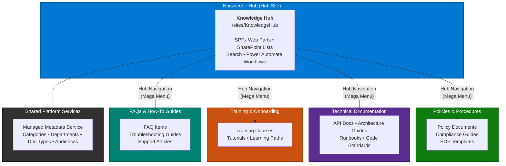
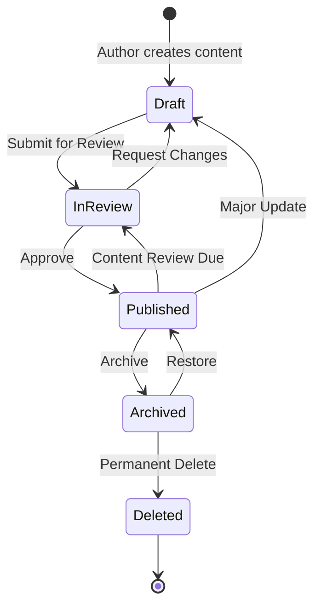

# SharePoint Online Knowledge Hub


A comprehensive enterprise Knowledge Hub solution for SharePoint Online featuring SPFx web parts, automated provisioning, content migration tools, Power Automate workflows, and a complete governance framework.

## Overview

Organizations struggle with scattered knowledge across file shares, wikis, email threads, and individual team sites. The Knowledge Hub centralizes organizational knowledge into a structured, searchable, and governed platform built entirely on SharePoint Online and the Microsoft 365 ecosystem.

**Value Proposition:**
- **Single source of truth** for organizational knowledge across departments
- **Enterprise search** with faceted refinement, suggestions, and search verticals
- **Content governance** with automated review cycles and approval workflows
- **Self-service migration** tools for onboarding existing content
- **Zero additional licensing** -- built on standard Microsoft 365 capabilities

## Architecture

### Hub Site Hierarchy



<details>
<summary>View ASCII architecture diagram</summary>

```
+------------------------------------------------------------------+
|                    Microsoft 365 Tenant                           |
|                                                                  |
|  +------------------------------------------------------------+ |
|  |              Knowledge Hub (Hub Site)                       | |
|  |                                                             | |
|  |  +------------------+  +------------------+                 | |
|  |  | SPFx Web Parts   |  | SharePoint Lists |                 | |
|  |  |                  |  |                  |                 | |
|  |  | - Article Viewer |  | - Knowledge      |                 | |
|  |  | - Advanced Search|  |   Articles       |                 | |
|  |  | - Featured       |  | - FAQs           |                 | |
|  |  | - FAQ Accordion  |  | - Article        |                 | |
|  |  | - Recently       |  |   Feedback       |                 | |
|  |  |   Updated        |  +------------------+                 | |
|  |  +------------------+                                       | |
|  |                                                             | |
|  |  +------------------+  +------------------+                 | |
|  |  | SharePoint Search|  | Power Automate   |                 | |
|  |  |                  |  |                  |                 | |
|  |  | - Result Source  |  | - Content        |                 | |
|  |  | - Managed Props  |  |   Approval       |                 | |
|  |  | - Refiners       |  | - Review         |                 | |
|  |  | - Verticals      |  |   Reminders      |                 | |
|  |  +------------------+  +------------------+                 | |
|  +------------------------------------------------------------+ |
|       |              |              |              |             |
|  +----------+  +----------+  +----------+  +----------+        |
|  | Policies |  | TechDocs |  | Training |  |   FAQs   |        |
|  | (Assoc.) |  | (Assoc.) |  | (Assoc.) |  | (Assoc.) |        |
|  +----------+  +----------+  +----------+  +----------+        |
|                                                                  |
|  +------------------------------------------------------------+ |
|  |              Managed Metadata Service                       | |
|  |  Categories | Departments | Doc Types | Audiences           | |
|  +------------------------------------------------------------+ |
+------------------------------------------------------------------+
```

</details>

## Features

### SPFx Web Parts (6)

| Web Part | Description | Icon |
|---|---|---|
| **Knowledge Article** | Full article viewer with metadata sidebar, breadcrumbs, related articles, and user feedback | ReadingMode |
| **Advanced Search** | Enterprise search with refiners, suggestions, sort options, search history, and pagination | Search |
| **Featured Content** | Featured/trending content in grid or carousel layout with animated transitions | FavoriteStar |
| **FAQ Accordion** | Interactive FAQ with category filters, search, and per-item helpfulness feedback | QandA |
| **Recently Updated** | Timeline-style feed with date grouping, change type indicators, and time range filters | Clock |
| **Analytics Dashboard** | Content analytics with top articles, search terms, freshness tracking, author contributions, and category distribution charts | BarChartVertical |

### Provisioning Scripts (PowerShell)

| Script | Purpose |
|---|---|
| `Deploy-KnowledgeHub.ps1` | Creates hub site + 4 associated sites with navigation and permissions |
| `Deploy-Taxonomy.ps1` | Deploys managed metadata (Categories, Departments, Doc Types, Audiences) |
| `Deploy-ContentTypes.ps1` | Creates content types (Knowledge Article, FAQ Item, Policy Document, Training Material) |
| `Configure-Search.ps1` | Configures result source, managed properties, refiners, and search verticals |

### Migration Toolkit

| Tool | Purpose |
|---|---|
| `Import-ContentFromCsv.ps1` | Bulk import from CSV with column mapping, taxonomy lookup, retry logic |
| `Export-SharePointContent.ps1` | Export list items to CSV with metadata and version history |
| `Validate-Migration.ps1` | Compare source CSV with SharePoint list and generate HTML validation report |
| `Transform-ContentMetadata.ps1` | Clean and normalize CSV data: title case, dates, URLs, taxonomy mapping |

### Content Health Monitoring

| Tool | Purpose |
|---|---|
| `Monitor-ContentHealth.ps1` | Detect stale content, orphaned pages, and broken links; generate HTML dashboard report |

### Power Automate Flows

| Flow | Purpose |
|---|---|
| Content Approval | Manager + optional SME review workflow for article publishing |
| Content Review Reminder | Weekly check for overdue reviews with escalation to managers |

### Governance Documentation

| Document | Description |
|---|---|
| Information Architecture | Site hierarchy, navigation, content types, taxonomy, URL strategy |
| Governance Framework | Permissions, content lifecycle, review schedule, compliance, training |
| Migration Guide | Pre-migration checklist, content audit, import steps, validation, rollback |
| Search Configuration | Managed properties, result sources, refiners, verticals, query rules |

## Content Lifecycle

The Knowledge Hub enforces a governed content lifecycle with automated review reminders and approval workflows.



## Visual Documentation

Detailed architecture diagrams are available in the `docs/diagrams/` directory:

| Diagram | Description | Path |
|---|---|---|
| **Hub Site Architecture** | Site hierarchy with hub navigation and associated sites | [`docs/diagrams/site-hierarchy.md`](docs/diagrams/site-hierarchy.md) |
| **Content Type Hierarchy** | SharePoint content type inheritance with field details | [`docs/diagrams/content-type-inheritance.md`](docs/diagrams/content-type-inheritance.md) |
| **Managed Metadata Taxonomy** | Term store structure (Categories, Departments, Doc Types, Audiences) | [`docs/diagrams/taxonomy-tree.md`](docs/diagrams/taxonomy-tree.md) |
| **Content Lifecycle** | State machine with transitions, roles, and notifications | [`docs/diagrams/content-lifecycle.md`](docs/diagrams/content-lifecycle.md) |
| **Permission Model** | Access matrix and permission inheritance flow | [`docs/diagrams/permission-model.md`](docs/diagrams/permission-model.md) |
| **Search Architecture** | End-to-end search flow sequence diagram | [`docs/diagrams/search-flow.md`](docs/diagrams/search-flow.md) |
| **Migration Pipeline** | Content migration workflow with validation steps | [`docs/diagrams/migration-flow.md`](docs/diagrams/migration-flow.md) |

## Screenshots

Interactive HTML mockups of the Knowledge Hub UI are available in the `docs/screenshots/` directory. Open any file in a browser to see the full mockup.

| View | Description | Path |
|---|---|---|
| **Hub Home Page** | Landing page with hero search, featured content, recent updates, and popular articles | [`docs/screenshots/hub-home.html`](docs/screenshots/hub-home.html) |
| **Advanced Search** | Search results with faceted refiners, sort options, search verticals, and pagination | [`docs/screenshots/advanced-search.html`](docs/screenshots/advanced-search.html) |
| **Article Viewer** | Knowledge article with metadata sidebar, table of contents, related articles, and feedback | [`docs/screenshots/article-viewer.html`](docs/screenshots/article-viewer.html) |
| **FAQ Accordion** | FAQ page with category pills, search filter, expandable answers, and helpfulness voting | [`docs/screenshots/faq-accordion.html`](docs/screenshots/faq-accordion.html) |
| **Recently Updated** | Timeline feed with date grouping, change type badges, and time range filters | [`docs/screenshots/recently-updated.html`](docs/screenshots/recently-updated.html) |
| **Migration Report** | Validation report dashboard with pass rate, detailed results table, and error summary | [`docs/screenshots/migration-report.html`](docs/screenshots/migration-report.html) |

## Prerequisites

- **Microsoft 365 tenant** with SharePoint Online
- **Node.js** >= 18.17.1 (for SPFx development)
- **PnP.PowerShell** module (`Install-Module PnP.PowerShell`)
- **SharePoint Administrator** role (for provisioning)
- **Global Reader** or **Search Administrator** role (for search configuration)

## Quick Start

### 1. Clone the Repository

```bash
git clone https://github.com/your-org/sharepoint-knowledge-hub.git
cd sharepoint-knowledge-hub
```

### 2. Provision the Infrastructure

```powershell
# Deploy hub site and associated sites
.\provisioning\sites\Deploy-KnowledgeHub.ps1 `
    -TenantAdminUrl "https://contoso-admin.sharepoint.com" `
    -HubSiteUrl "https://contoso.sharepoint.com/sites/KnowledgeHub"

# Deploy managed metadata taxonomy
.\provisioning\taxonomy\Deploy-Taxonomy.ps1 `
    -SiteUrl "https://contoso.sharepoint.com/sites/KnowledgeHub"

# Deploy content types and lists
.\provisioning\content-types\Deploy-ContentTypes.ps1 `
    -SiteUrl "https://contoso.sharepoint.com/sites/KnowledgeHub"

# Configure search
.\provisioning\search\Configure-Search.ps1 `
    -SiteUrl "https://contoso.sharepoint.com/sites/KnowledgeHub"
```

### 3. Build and Deploy Web Parts

```bash
cd spfx-webparts
npm install
npm run package
```

Upload the `.sppkg` file from `sharepoint/solution/` to the App Catalog.

### 4. Migrate Content

```powershell
# Dry run first
.\migration\scripts\Import-ContentFromCsv.ps1 `
    -SiteUrl "https://contoso.sharepoint.com/sites/KnowledgeHub" `
    -ListName "Knowledge Articles" `
    -CsvPath ".\migration\templates\article-import-template.csv" `
    -MappingFile ".\migration\templates\field-mapping-example.json" `
    -DryRun

# Full import
.\migration\scripts\Import-ContentFromCsv.ps1 `
    -SiteUrl "https://contoso.sharepoint.com/sites/KnowledgeHub" `
    -ListName "Knowledge Articles" `
    -CsvPath ".\your-articles.csv" `
    -MappingFile ".\your-mapping.json"
```

### 5. Configure Power Automate Flows

Follow the instructions in `power-automate-flows/README.md` to create the approval and review reminder flows.

## Web Parts Reference

### Knowledge Article Viewer

**Properties:**

| Property | Type | Default | Description |
|---|---|---|---|
| `articleListName` | string | "Knowledge Articles" | Source list name |
| `showBreadcrumb` | boolean | true | Show breadcrumb navigation |
| `showRelatedArticles` | boolean | true | Show related articles section |
| `showFeedback` | boolean | true | Show feedback widget |
| `relatedArticleCount` | number | 5 | Number of related articles |
| `layoutStyle` | choice | "standard" | standard, wide, or compact |

### Advanced Search

**Properties:**

| Property | Type | Default | Description |
|---|---|---|---|
| `resultsPerPage` | number | 10 | Results per page (5-50) |
| `showRefiners` | boolean | true | Show refiner panel |
| `showSuggestions` | boolean | true | Enable typeahead suggestions |
| `showSearchHistory` | boolean | true | Show recent searches |
| `resultSourceId` | string | "" | Custom result source GUID |

### Featured Content

**Properties:**

| Property | Type | Default | Description |
|---|---|---|---|
| `contentSource` | string | "Knowledge Articles" | Source list name |
| `itemCount` | number | 6 | Number of items (3-12) |
| `layoutMode` | choice | "grid" | grid or carousel |
| `showTrending` | boolean | true | Show trending tab |
| `autoRotate` | boolean | true | Auto-rotate carousel |
| `rotateInterval` | number | 5 | Seconds between rotations |

### FAQ Accordion

**Properties:**

| Property | Type | Default | Description |
|---|---|---|---|
| `faqListName` | string | "FAQs" | FAQ list name |
| `defaultCategory` | string | "" | Pre-selected category |
| `showSearch` | boolean | true | Show search filter |
| `showFeedback` | boolean | true | Show helpfulness buttons |
| `expandFirst` | boolean | false | Auto-expand first item |

### Recently Updated

**Properties:**

| Property | Type | Default | Description |
|---|---|---|---|
| `itemCount` | number | 10 | Items per load (5-50) |
| `sourceLists` | string | "Knowledge Articles,FAQs" | Comma-separated list names |
| `defaultTimeRange` | choice | "week" | today, week, or month |
| `defaultViewMode` | choice | "compact" | compact or detailed |

### Analytics Dashboard

**Properties:**

| Property | Type | Default | Description |
|---|---|---|---|
| `articleListName` | string | "Knowledge Articles" | Source list for article data |
| `faqListName` | string | "FAQs" | Source list for FAQ data |
| `dateRange` | number | 30 | Date range in days (7-365) |
| `articleCount` | number | 10 | Number of top articles to display (5-25) |
| `chartType` | choice | "bar" | bar, horizontal, or donut |
| `showTopArticles` | boolean | true | Show top articles by views |
| `showSearchTerms` | boolean | true | Show popular search terms |
| `showContentFreshness` | boolean | true | Show content freshness indicators |
| `showAuthorContributions` | boolean | true | Show author contribution chart |
| `showCategoryDistribution` | boolean | true | Show category distribution chart |

## Provisioning Reference

All provisioning scripts support the `-WhatIf` flag for preview mode and accept an optional `-Credential` parameter for non-interactive authentication.

```powershell
# Preview mode (no changes made)
.\Deploy-KnowledgeHub.ps1 -TenantAdminUrl "..." -HubSiteUrl "..." -WhatIf

# Non-interactive with saved credentials
$cred = Get-Credential
.\Deploy-KnowledgeHub.ps1 -TenantAdminUrl "..." -HubSiteUrl "..." -Credential $cred
```

## Documentation Index

### Governance & Architecture Docs

| Document | Path | Description |
|---|---|---|
| Information Architecture | [`docs/information-architecture.md`](docs/information-architecture.md) | Site hierarchy, navigation, content types, managed metadata taxonomy, URL strategy |
| Governance Framework | [`docs/governance-framework.md`](docs/governance-framework.md) | Permissions model, content lifecycle, review schedule, compliance, training plan |
| Migration Guide | [`docs/migration-guide.md`](docs/migration-guide.md) | Content audit, field mapping, batch import, validation, rollback procedures |
| Search Configuration | [`docs/search-configuration.md`](docs/search-configuration.md) | Managed properties, result sources, refiners, verticals, query rules, analytics |
| Power Automate Flows | [`power-automate-flows/README.md`](power-automate-flows/README.md) | Content approval and review reminder flow configuration |

### Architecture Diagrams

| Diagram | Path | Description |
|---|---|---|
| Site Hierarchy | [`docs/diagrams/site-hierarchy.md`](docs/diagrams/site-hierarchy.md) | Hub site + 4 associated sites with navigation model |
| Content Type Inheritance | [`docs/diagrams/content-type-inheritance.md`](docs/diagrams/content-type-inheritance.md) | System to custom content type inheritance tree |
| Taxonomy Tree | [`docs/diagrams/taxonomy-tree.md`](docs/diagrams/taxonomy-tree.md) | Full managed metadata term store structure |
| Content Lifecycle | [`docs/diagrams/content-lifecycle.md`](docs/diagrams/content-lifecycle.md) | State machine with roles and notifications |
| Permission Model | [`docs/diagrams/permission-model.md`](docs/diagrams/permission-model.md) | Access matrix and inheritance flow |
| Search Flow | [`docs/diagrams/search-flow.md`](docs/diagrams/search-flow.md) | End-to-end search sequence diagram |
| Migration Pipeline | [`docs/diagrams/migration-flow.md`](docs/diagrams/migration-flow.md) | 6-phase migration workflow |

## Project Structure

```
sharepoint-knowledge-hub/
|-- spfx-webparts/                    # SPFx web parts project
|   |-- src/
|   |   |-- services/                 # Shared service layer
|   |   |   |-- SearchService.ts      # Search + Graph API
|   |   |   |-- TaxonomyService.ts    # Managed metadata
|   |   |   +-- KnowledgeService.ts   # CRUD + feedback
|   |   +-- webparts/
|   |       |-- knowledgeArticle/     # Article viewer web part
|   |       |-- advancedSearch/       # Search web part
|   |       |-- featuredContent/      # Featured/trending web part
|   |       |-- faqAccordion/         # FAQ web part
|   |       |-- recentlyUpdated/      # Recent updates web part
|   |       +-- analyticsDashboard/   # Analytics dashboard web part
|   |-- config/                       # SPFx build configuration
|   +-- package.json
|-- provisioning/                     # Infrastructure as code
|   |-- sites/                        # Hub site + associated sites
|   |-- taxonomy/                     # Managed metadata term sets
|   |-- content-types/                # Content types + site columns
|   |-- search/                       # Search schema + verticals
|   +-- monitoring/                   # Content health monitoring scripts
|-- migration/                        # Content migration toolkit
|   |-- scripts/                      # Import, export, validate, transform
|   +-- templates/                    # CSV templates + mapping files
|-- power-automate-flows/             # Workflow definitions
|-- docs/                             # Governance documentation
+-- README.md
```

## Contributing

See **[CONTRIBUTING.md](CONTRIBUTING.md)** for prerequisites, setup instructions, development workflow, and code style guidelines.

---

## Changelog

### v1.1.0

- Added Analytics Dashboard web part with top articles, search terms, content freshness, author contributions, and category distribution (pure CSS charts)
- Added `Monitor-ContentHealth.ps1` for detecting stale content, orphaned pages, and broken links with HTML dashboard report generation
- Added `Transform-ContentMetadata.ps1` for CSV data cleaning: title case, date normalization, URL validation, and taxonomy value mapping
- Updated web part count from 5 to 6

### v1.0.0

- Five SPFx web parts: Knowledge Article, Advanced Search, Featured Content, FAQ Accordion, Recently Updated
- Hub site provisioning with 4 associated sites, managed metadata taxonomy, content types, and search configuration
- Migration toolkit: CSV import, SharePoint export, and validation reporting
- Power Automate flows: Content Approval and Content Review Reminder
- Governance documentation: information architecture, governance framework, migration guide, search configuration
- Architecture diagrams and HTML screenshot mockups

---

## Roadmap

Planned features for future releases:

- **AI-powered search suggestions** -- Microsoft Copilot / Azure OpenAI integration for intelligent search auto-complete and answer extraction
- **Content translation** -- automatic article translation using Azure Cognitive Services with side-by-side bilingual views
- **Microsoft Teams tab integration** -- Teams tab app for browsing knowledge articles and FAQs without leaving Teams
- **Mobile app** -- Power Apps mobile companion for offline article reading and quick feedback submission
- **Content analytics API** -- REST API endpoint (Azure Function) exposing analytics data for external reporting and dashboard integration

---

## License

This project is licensed under the MIT License. See [LICENSE](LICENSE) for details.
