# Content Lifecycle State Machine

The following state diagram shows the complete lifecycle of content in the Knowledge Hub, from initial creation through archival or deletion. Each transition includes the trigger action, the responsible role, and the automated notification sent.

```mermaid
stateDiagram-v2
    [*] --> Draft: Author creates new content

    Draft --> InReview: Submit for Review
    note right of Draft
        <b>Who:</b> Content Author
        <b>Visibility:</b> Author + Editors only
        <b>Editing:</b> Author, Dept Editors
    end note

    InReview --> Published: Approve
    InReview --> Draft: Request Changes
    note right of InReview
        <b>Who:</b> Manager + optional SME
        <b>Visibility:</b> Author + Reviewers
        <b>Editing:</b> Locked
        <b>Notification:</b> Approval request
        sent to designated reviewer
    end note

    Published --> InReview: Content Review Due
    Published --> Archived: Archive (manual or policy)
    Published --> Draft: Major Update (creates new version)
    note right of Published
        <b>Who:</b> All employees can view
        <b>Visibility:</b> All authenticated users
        <b>Notification:</b> Author notified
        on approval / publication
    end note

    Archived --> Published: Restore
    Archived --> Deleted: Permanent Delete (after retention)
    note right of Archived
        <b>Who:</b> KH Admins only
        <b>Visibility:</b> KH Admins + Owners
        <b>Retention:</b> Per content type policy
    end note

    Deleted --> [*]
    note right of Deleted
        <b>Who:</b> KH Admin triggers
        <b>Hold:</b> 93 days in Recycle Bin
        <b>Notification:</b> Deletion audit
        logged for compliance
    end note
```

## Transition Details

| Transition | Trigger | Role | Automation | Notification |
|---|---|---|---|---|
| **New --> Draft** | Author creates article | Content Author | None | None |
| **Draft --> In Review** | Author clicks "Submit for Review" | Content Author | Power Automate: Content Approval flow starts | Reviewer receives approval request email |
| **In Review --> Published** | Reviewer approves | Content Reviewer / Manager | Power Automate: Status updated to Published | Author notified of approval; article visible to all |
| **In Review --> Draft** | Reviewer rejects | Content Reviewer / Manager | Power Automate: Status reverted to Draft | Author notified with reviewer feedback |
| **Published --> In Review** | Review date reached | Automated (Power Automate) | Content Review Reminder flow triggers | Author receives review reminder; escalation after grace period |
| **Published --> Draft** | Author clicks "Update Article" | Content Author | New version created in Draft | None |
| **Published --> Archived** | Manual by admin or 2+ years without update | KH Admin / Automated | Status changed; removed from active search | Author and dept champion notified |
| **Archived --> Published** | Admin restores article | KH Admin | Status changed; re-indexed for search | Author notified of restoration |
| **Archived --> Deleted** | Admin deletes after retention period | KH Admin | Item moved to Recycle Bin (93-day hold) | Deletion logged in audit trail |

## Review Schedule by Content Type

| Content Type | Review Frequency | Grace Period | Escalation Target |
|---|---|---|---|
| Knowledge Articles | Every 6 months | 14 days | Department Manager |
| Policy Documents | Every 12 months | 30 days | Legal / Compliance |
| FAQ Items | Every 3 months | 7 days | KH Administrator |
| Training Materials | Every 12 months | 14 days | Training Lead |
| Technical Documentation | Every 6 months | 14 days | Tech Lead |
