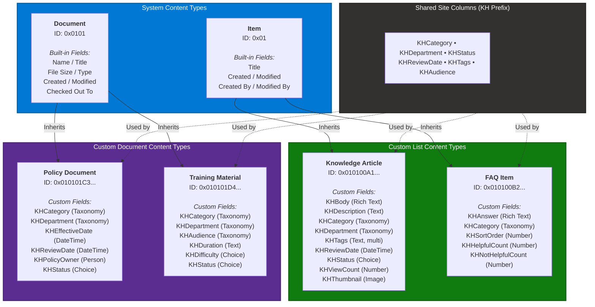

# Content Type Hierarchy

The Knowledge Hub uses SharePoint content type inheritance to define structured content schemas. System content types (Item and Document) serve as the base, with custom content types inheriting and extending them with Knowledge Hub-specific fields.

## Field Details

### Knowledge Article Fields

| Field | Internal Name | Type | Required | Description |
|---|---|---|---|---|
| Title | `Title` | Single line of text | Yes | Article title (inherited from Item) |
| Body | `KHBody` | Rich text (HTML) | Yes | Full article content |
| Description | `KHDescription` | Multiple lines (plain) | No | Short summary for search results |
| Category | `KHCategory` | Managed Metadata | Yes | Primary topic category |
| Department | `KHDepartment` | Managed Metadata | Yes | Owning department |
| Tags | `KHTags` | Single line of text | No | Semicolon-separated keywords |
| Review Date | `KHReviewDate` | Date/Time | Yes | Next scheduled review |
| Status | `KHStatus` | Choice | Yes | Draft, In Review, Published, Archived |
| View Count | `KHViewCount` | Number | No | Total page views |
| Thumbnail | `KHThumbnail` | Image | No | Card thumbnail image |

### FAQ Item Fields

| Field | Internal Name | Type | Required | Description |
|---|---|---|---|---|
| Question | `Title` | Single line of text | Yes | The FAQ question (uses Title field) |
| Answer | `KHAnswer` | Rich text (HTML) | Yes | The answer content |
| Category | `KHCategory` | Managed Metadata | Yes | FAQ category |
| Sort Order | `KHSortOrder` | Number | No | Display order within category |
| Helpful Count | `KHHelpfulCount` | Number | No | "Yes, helpful" votes |
| Not Helpful Count | `KHNotHelpfulCount` | Number | No | "No, not helpful" votes |

### Policy Document Fields

| Field | Internal Name | Type | Required | Description |
|---|---|---|---|---|
| Category | `KHCategory` | Managed Metadata | Yes | Policy category |
| Department | `KHDepartment` | Managed Metadata | Yes | Owning department |
| Effective Date | `KHEffectiveDate` | Date/Time | Yes | When policy takes effect |
| Review Date | `KHReviewDate` | Date/Time | Yes | Next review date |
| Policy Owner | `KHPolicyOwner` | Person or Group | Yes | Responsible person |
| Status | `KHStatus` | Choice | Yes | Draft, In Review, Published, Archived |

### Training Material Fields

| Field | Internal Name | Type | Required | Description |
|---|---|---|---|---|
| Category | `KHCategory` | Managed Metadata | Yes | Training category |
| Department | `KHDepartment` | Managed Metadata | Yes | Owning department |
| Audience | `KHAudience` | Managed Metadata | Yes | Target audience |
| Duration | `KHDuration` | Single line of text | No | Estimated duration (e.g., "45 min") |
| Difficulty | `KHDifficulty` | Choice | No | Beginner, Intermediate, Advanced |
| Status | `KHStatus` | Choice | Yes | Draft, In Review, Published, Archived |
