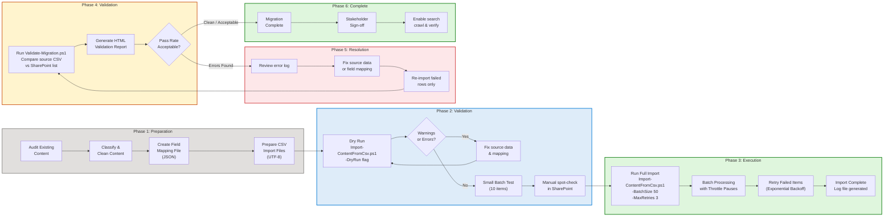

# Content Migration Pipeline

The following flowchart shows the end-to-end content migration process, from initial content audit through validation and completion. The pipeline includes batch processing, error handling, retry logic, and automated validation reporting.

## Pipeline Steps in Detail

### Phase 1: Preparation

| Step | Action | Output | Tools |
|---|---|---|---|
| 1.1 | Audit existing content across all sources | Content inventory spreadsheet | Manual + Export-SharePointContent.ps1 |
| 1.2 | Classify and clean content (remove obsolete, consolidate duplicates) | Cleaned content set | Manual review |
| 1.3 | Create JSON field mapping file | `field-mapping.json` | Text editor; based on `field-mapping-example.json` |
| 1.4 | Prepare CSV import files (UTF-8, proper date formats, taxonomy terms) | `articles.csv`, `faqs.csv` | Excel/text editor; based on import templates |

### Phase 2: Pre-flight Validation

| Step | Action | Output | Tools |
|---|---|---|---|
| 2.1 | Dry run import with `-DryRun` flag | Console warnings and errors | `Import-ContentFromCsv.ps1 -DryRun` |
| 2.2 | Fix any data issues found in dry run | Updated CSV / mapping files | Manual |
| 2.3 | Small batch test (10 items) | 10 items created in SharePoint | `Import-ContentFromCsv.ps1 -BatchSize 10` |
| 2.4 | Manual spot-check in browser | Verification notes | Manual review in SharePoint |

### Phase 3: Execution

| Step | Action | Output | Tools |
|---|---|---|---|
| 3.1 | Full import with batch processing | All items created in SharePoint | `Import-ContentFromCsv.ps1 -BatchSize 50 -MaxRetries 3` |
| 3.2 | Monitor progress bar and log output | Import log file | Console output |
| 3.3 | Review import log for any failures | Error CSV (if any failures) | Log review |

### Phase 4: Post-Migration Validation

| Step | Action | Output | Tools |
|---|---|---|---|
| 4.1 | Run automated validation | Comparison results | `Validate-Migration.ps1` |
| 4.2 | Generate HTML validation report | `validation-report.html` | Auto-generated by script |
| 4.3 | Review pass rate and error details | Go / No-Go decision | Manual review |

### Phase 5: Error Resolution (if needed)

| Step | Action | Output | Tools |
|---|---|---|---|
| 5.1 | Review error log from validation | List of failed items | Error CSV |
| 5.2 | Fix source data or field mapping | Corrected CSV / mapping | Manual |
| 5.3 | Re-import only failed rows | Fixed items in SharePoint | `Import-ContentFromCsv.ps1` (subset) |
| 5.4 | Re-validate | Updated validation report | `Validate-Migration.ps1` |

### Phase 6: Completion

| Step | Action | Output | Tools |
|---|---|---|---|
| 6.1 | Confirm acceptable pass rate | Migration complete | Manual |
| 6.2 | Stakeholder sign-off | Approval documented | Email / meeting |
| 6.3 | Verify search crawl picks up new content | Content appears in search | SharePoint Search |
