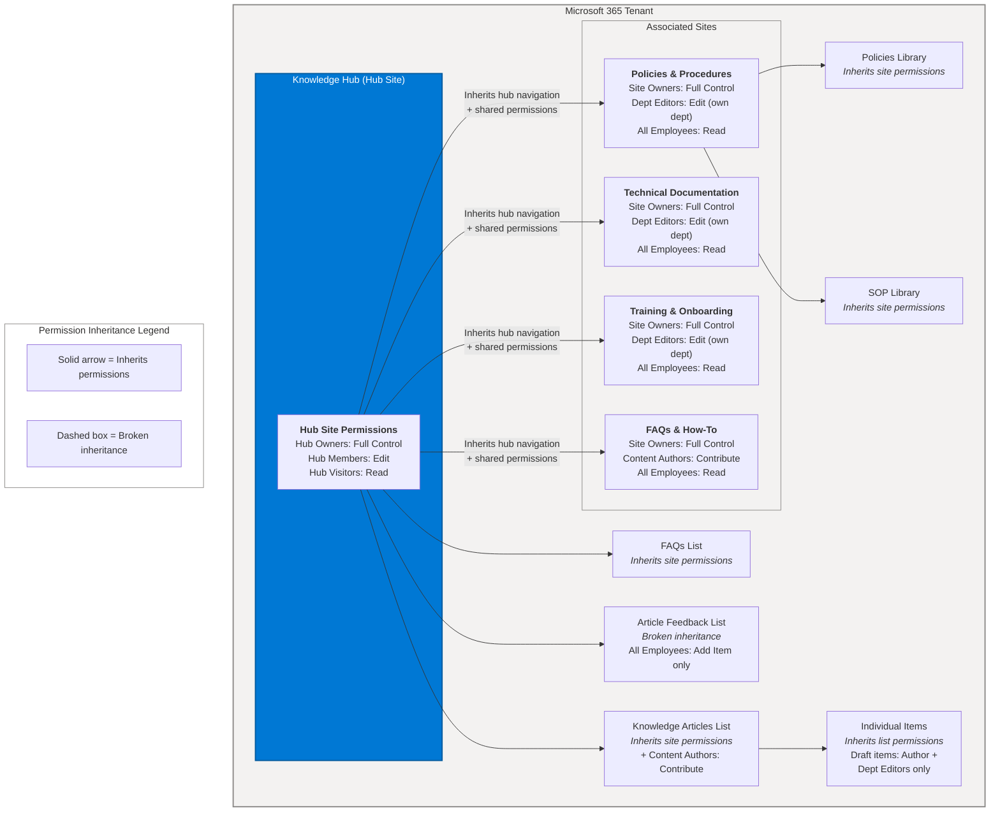

# Permission Model

## Permission Matrix

The following table shows the access level each role has across all Knowledge Hub sites. This matrix governs what each user group can do within the hub ecosystem.

| Role | Knowledge Hub | Policies & Procedures | Tech Docs | Training & Onboarding | FAQs & How-To |
|---|---|---|---|---|---|
| **Hub Owners** | Full Control | Full Control | Full Control | Full Control | Full Control |
| **Hub Members** | Edit | Read | Read | Read | Edit |
| **Site Owners** | Full Control | Full Control (own site) | Full Control (own site) | Full Control (own site) | Full Control (own site) |
| **Content Authors** | Contribute | Read | Read | Read | Contribute |
| **Content Reviewers** | Edit | Edit | Edit | Edit | Edit |
| **Readers** | Read | Read | Read | Read | Read |
| **External Users** | No Access | No Access | No Access | Read (selected) | No Access |

### Access Level Legend

| Level | Capabilities |
|---|---|
| **Full Control** | All permissions including site settings, permissions management, and deletion |
| **Edit** | Add, edit, and delete list items and documents |
| **Contribute** | Add and edit own items; cannot delete others' items |
| **Read** | View items and pages only; no editing |
| **No Access** | No access to the site or its content |

## Permission Inheritance Flow

The following diagram shows how permissions flow from the hub site down through associated sites, lists, and individual items. Breaking inheritance is used sparingly and only where business requirements demand it.

## Role Membership

| Role | Typical Members | How Assigned |
|---|---|---|
| **Hub Owners** | IT Admin, Knowledge Management Lead | Manual assignment by tenant admin |
| **Hub Members** | All employees (via security group) | Azure AD group "All Employees" |
| **Site Owners** | Department leads, KH Administrators | Manual assignment per site |
| **Content Authors** | Subject matter experts, designated contributors | Added by Site Owners or KH Admins |
| **Content Reviewers** | Managers, senior SMEs, compliance officers | Added by Site Owners; triggered via approval flow |
| **Readers** | All authenticated users | Default via Hub Members group |
| **External Users** | Partners, contractors (approved) | Azure AD B2B invitation; limited to specific libraries |

## Security Best Practices

1. **Use Azure AD groups** for role assignment rather than individual user accounts
2. **Minimize broken inheritance** -- only break at the list level when absolutely necessary (e.g., Article Feedback)
3. **Draft content visibility** -- use item-level permissions to restrict Draft items to authors and editors
4. **External sharing** -- disabled by default; enabled only for specific Training content via site-level sharing settings
5. **Audit regularly** -- quarterly review of site permissions using `Get-PnPSiteCollectionAdmin` and `Get-PnPGroup`
6. **Principle of least privilege** -- grant the minimum access level needed for each role
