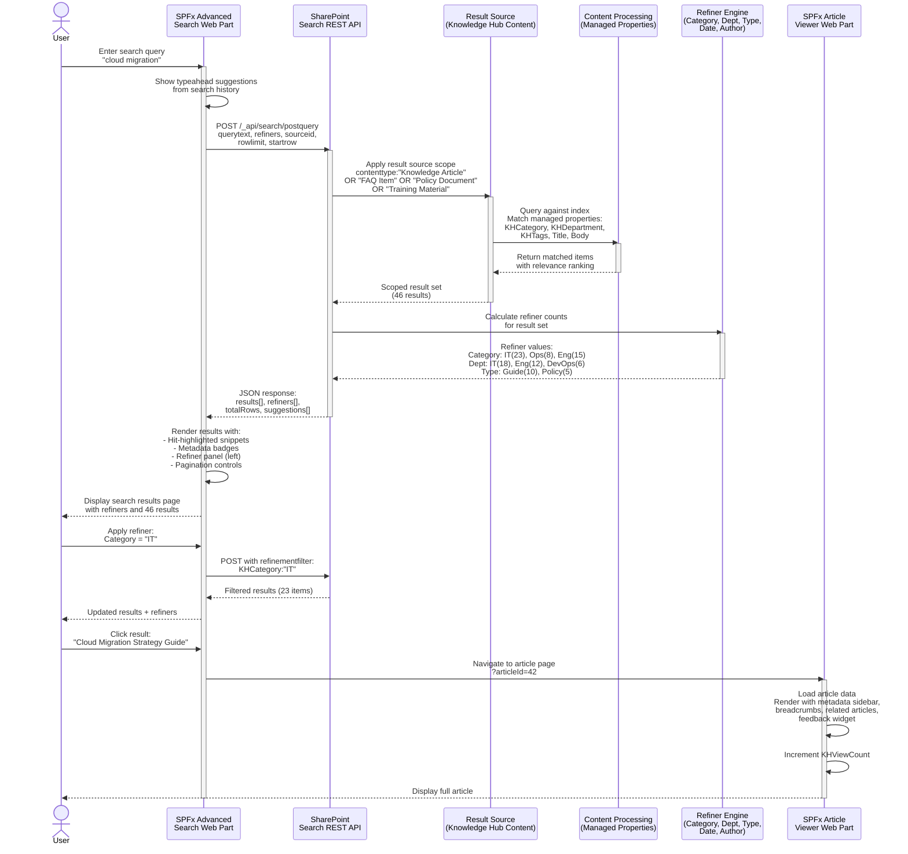

# Search Architecture

The following sequence diagram illustrates the end-to-end search flow in the Knowledge Hub, from the user entering a query through result rendering and article viewing. The architecture leverages SharePoint Search with custom managed properties, a scoped result source, and SPFx web parts for the presentation layer.

## Search Components Summary

| Component | Technology | Purpose |
|---|---|---|
| **Search Web Part** | SPFx (React 18 + Fluent UI v9) | User-facing search interface with refiners, suggestions, history |
| **Search REST API** | SharePoint REST (`/_api/search/postquery`) | Backend query execution and result retrieval |
| **Result Source** | SharePoint Search Administration | Scopes queries to Knowledge Hub content types only |
| **Managed Properties** | SharePoint Search Schema | Maps crawled properties to queryable/refinable properties |
| **Refiners** | SharePoint Search Refinement | Faceted navigation: Category, Department, Content Type, Date, Author |
| **Article Viewer** | SPFx (React 18 + Fluent UI v9) | Renders full article with metadata, related content, feedback |

## Query Flow Details

1. **User Input** -- User types query in the Advanced Search web part; typeahead suggestions appear from search history and popular queries
2. **Query Construction** -- Web part builds a Search REST API POST request with the query text, result source ID, requested managed properties, refiners, row limit, and start row for pagination
3. **Result Source Scoping** -- The Knowledge Hub Content result source applies a KQL filter to limit results to the four Knowledge Hub content types
4. **Index Matching** -- SharePoint Search matches the query against the full-text index and managed properties (KHCategory, KHDepartment, KHTags, Title, Body)
5. **Relevance Ranking** -- Results are ranked by relevance using SharePoint's ranking model, which considers term frequency, field weights, recency, and popularity (view count)
6. **Refiner Calculation** -- The refiner engine calculates value counts for each configured refiner within the result set
7. **Response Rendering** -- The web part renders results with hit-highlighted snippets, metadata badges, a left-panel refiner UI, and pagination controls
8. **Refiner Filtering** -- When a user selects a refiner value, the web part sends a new query with a `refinementfilter` parameter to narrow results
9. **Article Navigation** -- Clicking a result navigates to the article page, where the Article Viewer web part loads and renders the full content
