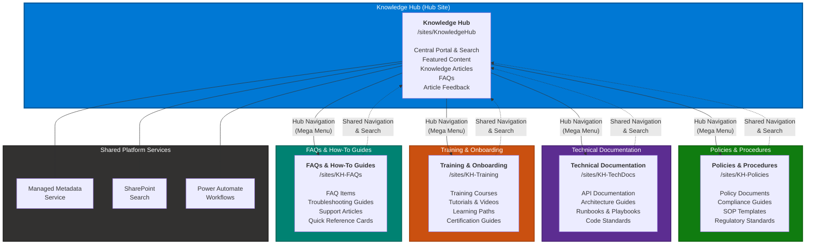

# Hub Site Architecture

The following diagram illustrates the SharePoint Online hub site architecture, including the central Knowledge Hub and its four associated sites. Hub navigation (mega menu) connects all sites into a unified information architecture.

## Navigation Model

All associated sites inherit the hub site mega menu navigation, providing a consistent top-level experience across the entire Knowledge Hub ecosystem. Users can seamlessly navigate between any site without losing context.

| Navigation Element | Scope | Items |
|---|---|---|
| **Hub Mega Menu** | All 5 sites | Home, Knowledge Base, Policies, Tech Docs, Training, FAQs |
| **Hub Site Local Nav** | Knowledge Hub only | Home, Articles, FAQs, Search, Categories, Submit Content |
| **Associated Site Local Nav** | Each associated site | Home, Documents, By Category, By Department, Recent |
