# Managed Metadata Taxonomy

The Knowledge Hub taxonomy is managed through the SharePoint Managed Metadata Service (Term Store). A single term group contains four term sets that provide consistent, controlled vocabulary for classifying and discovering content across all hub sites.

```mermaid
graph TD
    subgraph TermGroup["Term Group: Knowledge Hub"]
        style TermGroup fill:#0078d4,color:#fff,stroke:#005a9e,stroke-width:3px
        TG["<b>Knowledge Hub</b><br/>Term Group"]
    end

    TG --> TS1
    TG --> TS2
    TG --> TS3
    TG --> TS4

    subgraph Categories["Term Set: Categories"]
        style Categories fill:#107c10,color:#fff,stroke:#0b5c0b,stroke-width:2px
        TS1["<b>Categories</b>"]

        TS1 --> IT["IT & Technology"]
        IT --> IT1["Infrastructure"]
        IT --> IT2["Security"]
        IT --> IT3["Development"]
        IT --> IT4["Cloud Services"]
        IT --> IT5["Networking"]

        TS1 --> HR["Human Resources"]
        HR --> HR1["Benefits"]
        HR --> HR2["Onboarding"]
        HR --> HR3["Policies"]
        HR --> HR4["Training & Development"]
        HR --> HR5["Employee Relations"]

        TS1 --> FIN["Finance"]
        FIN --> FIN1["Budgeting"]
        FIN --> FIN2["Reporting"]
        FIN --> FIN3["Compliance"]
        FIN --> FIN4["Expense Reports"]
        FIN --> FIN5["Procurement"]

        TS1 --> OPS["Operations"]
        OPS --> OPS1["Facilities"]
        OPS --> OPS2["Procurement"]
        OPS --> OPS3["Logistics"]
        OPS --> OPS4["Quality Assurance"]
        OPS --> OPS5["Health & Safety"]

        TS1 --> ENG["Engineering"]
        ENG --> ENG1["Architecture"]
        ENG --> ENG2["DevOps"]
        ENG --> ENG3["QA & Testing"]
        ENG --> ENG4["Code Standards"]
        ENG --> ENG5["Development Practices"]

        TS1 --> LEG["Legal & Compliance"]
        LEG --> LEG1["Regulatory"]
        LEG --> LEG2["Data Privacy"]
        LEG --> LEG3["Contracts"]

        TS1 --> MKT["Marketing"]
        MKT --> MKT1["Brand Guidelines"]
        MKT --> MKT2["Campaigns"]
        MKT --> MKT3["Communications"]
    end

    subgraph Departments["Term Set: Departments"]
        style Departments fill:#5c2d91,color:#fff,stroke:#441f6e,stroke-width:2px
        TS2["<b>Departments</b>"]
        TS2 --> D1["Information Technology"]
        TS2 --> D2["Human Resources"]
        TS2 --> D3["Finance"]
        TS2 --> D4["Operations"]
        TS2 --> D5["Engineering"]
        TS2 --> D6["Legal"]
        TS2 --> D7["Marketing"]
        TS2 --> D8["Sales"]
        TS2 --> D9["Executive"]
        TS2 --> D10["Customer Support"]
        TS2 --> D11["Product"]
    end

    subgraph DocTypes["Term Set: Document Types"]
        style DocTypes fill:#ca5010,color:#fff,stroke:#a1400c,stroke-width:2px
        TS3["<b>Document Types</b>"]
        TS3 --> DT1["Policy"]
        TS3 --> DT2["Procedure"]
        TS3 --> DT3["Guide"]
        TS3 --> DT4["Template"]
        TS3 --> DT5["FAQ"]
        TS3 --> DT6["Training"]
        TS3 --> DT7["Reference"]
        TS3 --> DT8["Standard"]
        TS3 --> DT9["Form"]
        TS3 --> DT10["Report"]
    end

    subgraph Audiences["Term Set: Audiences"]
        style Audiences fill:#008272,color:#fff,stroke:#005e54,stroke-width:2px
        TS4["<b>Audiences</b>"]
        TS4 --> A1["All Staff"]
        TS4 --> A2["Management"]
        TS4 --> A3["IT Staff"]
        TS4 --> A4["New Hires"]
        TS4 --> A5["Executives"]
        TS4 --> A6["Contractors"]
        TS4 --> A7["Department Heads"]
        TS4 --> A8["Compliance Team"]
        TS4 --> A9["Support Team"]
    end
```

## Term Set Summary

| Term Set | Purpose | Term Count | Used By |
|---|---|---|---|
| **Categories** | Topic classification with two-level hierarchy | 7 top-level, 33 child terms | Knowledge Articles, FAQs, Policies, Training Materials |
| **Departments** | Organizational ownership | 11 terms (flat) | All content types |
| **Document Types** | Content format classification | 10 terms (flat) | Search refiners, content views |
| **Audiences** | Target reader groups | 9 terms (flat) | Training Materials, audience targeting |

## Taxonomy Governance

| Aspect | Rule |
|---|---|
| **Who can add terms** | KH Administrators and Knowledge Management Lead only |
| **Term deprecation** | Terms are deprecated (hidden from new tagging) rather than deleted |
| **Synonyms** | Configured for common variations (e.g., "IT" maps to "Information Technology") |
| **Default language** | English (US), with option to add translations |
| **Review cadence** | Quarterly review of term usage and gaps |
