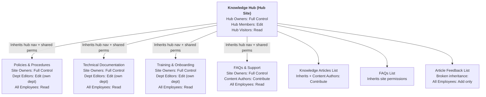
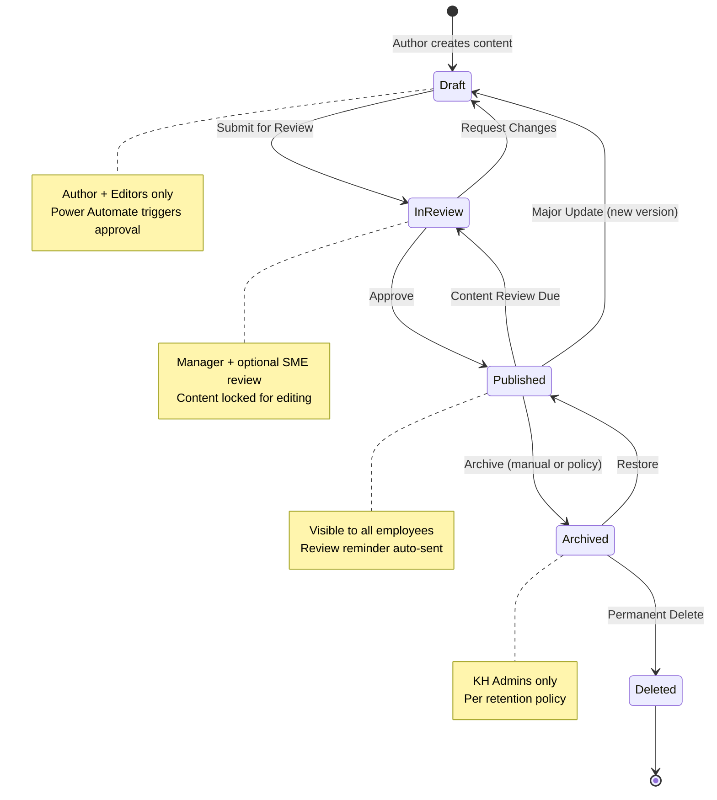

# Governance Framework

## Permission Matrix

### Site-Level Permissions

| Site | KH Owners | KH Members | KH Visitors | Content Authors | Department Editors |
|---|---|---|---|---|---|
| Knowledge Hub | Full Control | Edit | Read | Contribute | - |
| KH-Policies | Full Control | Read | Read | - | Edit (own dept) |
| KH-TechDocs | Full Control | Read | Read | - | Edit (own dept) |
| KH-Training | Full Control | Read | Read | - | Edit (own dept) |
| KH-FAQs | Full Control | Edit | Read | Contribute | - |

### Library/List-Level Permissions

| List/Library | Content Authors | Department Editors | All Employees |
|---|---|---|---|
| Knowledge Articles | Add + Edit own | Edit dept items | Read (Published only) |
| FAQs | Add + Edit own | Edit dept items | Read |
| Article Feedback | Add | - | Add |
| Policies (library) | - | Add + Edit own | Read |
| Training Materials | - | Add + Edit own | Read |

### Role Definitions

| Role | Members | Responsibilities |
|---|---|---|
| **KH Owners** | IT Admin, KM Lead | Full site administration, permissions management, provisioning |
| **KH Members** | All employees | Browse, search, view published content, submit feedback |
| **KH Visitors** | External guests | Read-only access to approved public content |
| **Content Authors** | SMEs, designated contributors | Create and edit knowledge articles and FAQs |
| **Department Editors** | Department leads/delegates | Manage content for their department across associated sites |
| **KH Administrators** | Knowledge Management team | Content governance, analytics review, taxonomy management |

### Permission Inheritance Flow



> See the full permission model with role details: [`docs/diagrams/permission-model.md`](diagrams/permission-model.md)

## Content Lifecycle

```
  +-------+      +----------+      +-----------+      +----------+      +--------+
  | DRAFT | ---> | IN REVIEW| ---> | PUBLISHED | ---> | ARCHIVED | ---> | DELETE  |
  +-------+      +----------+      +-----------+      +----------+      +--------+
      ^               |                  |                  |
      |               |                  |                  |
      +-- Rejected ---+                  +--- Review Due ---+
                                         |   (auto-flag)
                                         |
                                         +--- Major Update ---> DRAFT
```

### Content Lifecycle State Machine



> See the full lifecycle diagram with transition details and notifications: [`docs/diagrams/content-lifecycle.md`](diagrams/content-lifecycle.md)

### Status Descriptions

| Status | Description | Visibility | Who Can Edit |
|---|---|---|---|
| **Draft** | Content is being created or revised | Author + Editors only | Author, Dept Editors |
| **In Review** | Submitted for approval (manager + optional SME) | Author + Reviewers | Locked for editing |
| **Published** | Approved and visible to all users | All employees | Dept Editors (creates new Draft) |
| **Archived** | No longer current; retained for reference | KH Admins + Owners | KH Admins only |

### Lifecycle Triggers

| Transition | Trigger | Automation |
|---|---|---|
| Draft --> In Review | Author clicks "Submit for Review" | Power Automate: Content Approval |
| In Review --> Published | Approval received | Power Automate: Status update + notification |
| In Review --> Draft | Rejection received | Power Automate: Status update + feedback |
| Published --> Archived | Manual by admin OR 2 years without update | Manual or scheduled flow |
| Archived --> Delete | Manual by KH Admin after retention period | Manual (90-day hold in Recycle Bin) |
| Published --> Draft | Author clicks "Update Article" (creates new version) | Manual |

## Review Schedule

| Content Type | Review Frequency | Grace Period | Escalation |
|---|---|---|---|
| Knowledge Articles | 6 months | 14 days | Manager after grace period |
| Policy Documents | 12 months | 30 days | Legal/Compliance after grace period |
| FAQ Items | 3 months | 7 days | KH Admin after grace period |
| Training Materials | 12 months | 14 days | Training Lead after grace period |
| Technical Documentation | 6 months | 14 days | Tech Lead after grace period |

The **Content Review Reminder** Power Automate flow runs weekly (Mondays, 9 AM ET) and:
1. Identifies articles with `ReviewDate` in the past
2. Sends reminder emails to content authors
3. Escalates to managers after the grace period
4. Sends a weekly summary to KH administrators

## Content Ownership Model

### Ownership Hierarchy

```
Knowledge Management Lead (KH Owner)
|
+-- Department Knowledge Champions (1 per department)
|   |
|   +-- Content Authors (SMEs within the department)
|
+-- KH Administrators (cross-department governance)
```

### Responsibilities by Role

**Knowledge Management Lead**
- Overall KH strategy and governance
- Taxonomy management and evolution
- Cross-department content coordination
- Analytics and reporting
- Training for content contributors

**Department Knowledge Champions**
- Department-level content strategy
- Ensure content quality and accuracy
- Coordinate review cycles within department
- Identify content gaps
- Onboard new content authors

**Content Authors**
- Create and maintain assigned articles
- Respond to feedback and comments
- Complete reviews by scheduled dates
- Follow content standards and templates
- Tag content with appropriate metadata

**KH Administrators**
- Site administration and permissions
- Search configuration and optimization
- Content type and taxonomy updates
- Migration and bulk operations
- Technical troubleshooting

## Compliance Requirements

### Data Classification

| Classification | Description | Handling |
|---|---|---|
| **Public** | General knowledge, no restrictions | Published to all employees; may share externally |
| **Internal** | Company-specific but non-sensitive | Published to all employees; no external sharing |
| **Confidential** | Sensitive business information | Restricted to specific departments/roles |
| **Highly Confidential** | Regulated or legally privileged | Not stored in Knowledge Hub; link to secure location |

### Retention Policy

| Content Type | Active Retention | Archive Retention | Total |
|---|---|---|---|
| Knowledge Articles | While Published | 2 years | Published + 2 years |
| Policy Documents | While Effective | 7 years | Effective + 7 years |
| FAQ Items | While Published | 1 year | Published + 1 year |
| Training Materials | While Current | 3 years | Current + 3 years |
| Article Feedback | 1 year | 1 year | 2 years total |

### Audit Requirements

- All content changes tracked via SharePoint version history
- Approval workflow audit trail maintained in Power Automate run history
- Monthly analytics report generated for KH Administrators
- Quarterly governance review meeting

## Training Plan for Content Maintainers

### Onboarding (New Content Authors)

| Session | Duration | Topics |
|---|---|---|
| KH Overview | 30 min | Architecture, navigation, content types, taxonomy |
| Content Creation | 45 min | Article creation, metadata tagging, formatting standards |
| Review Process | 30 min | Submission, approval workflow, feedback handling |
| Search Optimization | 15 min | Writing for search, tag selection, descriptions |

### Ongoing Training

| Activity | Frequency | Audience |
|---|---|---|
| Content Standards Refresher | Quarterly | All authors |
| Taxonomy Updates Review | As needed | Knowledge Champions |
| Analytics Review | Monthly | Champions + KM Lead |
| Governance Policy Review | Annually | All KH roles |

### Self-Service Resources

- Content Author Quick Reference Guide (PDF)
- Video: Creating Your First Article (5 min)
- Video: Submitting for Review (3 min)
- FAQ: Common Content Questions
- Template: Article Structure Guide
