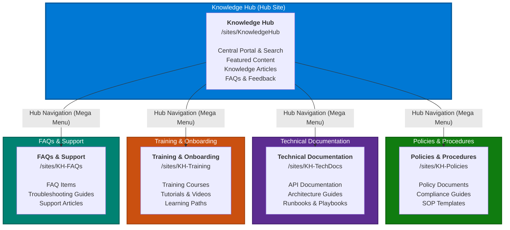
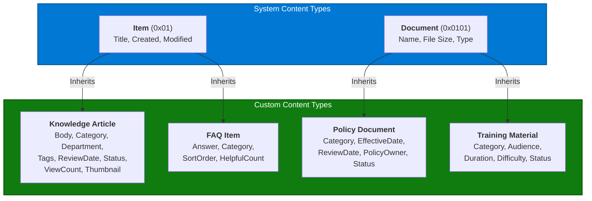

# Information Architecture

## Site Hierarchy

```
Contoso SharePoint Tenant
|
+-- Knowledge Hub (Communication Site / Hub Site)
    |   URL: /sites/KnowledgeHub
    |   Purpose: Central portal, search, featured content, home page
    |
    +-- Policies & Procedures (Associated Site)
    |   URL: /sites/KH-Policies
    |   Content: Policy documents, SOPs, compliance materials
    |
    +-- Technical Documentation (Associated Site)
    |   URL: /sites/KH-TechDocs
    |   Content: API docs, architecture guides, runbooks
    |
    +-- Training Materials (Associated Site)
    |   URL: /sites/KH-Training
    |   Content: Training courses, tutorials, learning paths
    |
    +-- FAQs & Support (Associated Site)
        URL: /sites/KH-FAQs
        Content: FAQ items, troubleshooting guides, support articles
```

### Site Hierarchy Diagram



> See the full detailed diagram: [`docs/diagrams/site-hierarchy.md`](diagrams/site-hierarchy.md)

## Navigation Structure

### Hub (Mega Menu)

```
Home | Knowledge Base      | Policies | Tech Docs | Training | FAQs
       +-- All Articles
       +-- Search
       +-- Recently Updated
       +-- Featured
```

### Hub Site Local Navigation

```
Home > Articles > FAQs > Search > Categories > Submit Content
```

### Associated Site Navigation (inherits hub nav + local)

```
[Hub Navigation]
----
Home > Documents > By Category > By Department > Recent
```

## Content Type Inheritance

```
Item (0x01)
|
+-- Knowledge Article (0x010100A1...)
|   Fields: Title, Body, Description, Category, Department,
|           Tags, ReviewDate, Status, ViewCount, Thumbnail
|
+-- FAQ Item (0x010100B2...)
    Fields: Title (Question), Answer, Category, SortOrder,
            HelpfulCount, NotHelpfulCount

Document (0x0101)
|
+-- Policy Document (0x010101C3...)
|   Fields: + Category, Department, EffectiveDate, ReviewDate,
|             PolicyOwner, Status
|
+-- Training Material (0x010101D4...)
    Fields: + Category, Department, Audience, Duration,
              Difficulty, Status
```

### Content Type Inheritance Diagram



> See full field details: [`docs/diagrams/content-type-inheritance.md`](diagrams/content-type-inheritance.md)

## Metadata Taxonomy

> For the full taxonomy tree diagram with all child terms, see [`docs/diagrams/taxonomy-tree.md`](diagrams/taxonomy-tree.md).

```
Knowledge Hub (Term Group)
|
+-- Categories (Term Set)
|   +-- IT & Technology
|   |   +-- Software
|   |   +-- Hardware
|   |   +-- Networking
|   |   +-- Security
|   |   +-- Cloud Services
|   +-- Human Resources
|   |   +-- Benefits
|   |   +-- Onboarding
|   |   +-- Policies
|   |   +-- Training & Development
|   |   +-- Employee Relations
|   +-- Finance
|   |   +-- Budgeting
|   |   +-- Expense Reports
|   |   +-- Procurement
|   |   +-- Accounts Payable
|   +-- Operations
|   |   +-- Facilities
|   |   +-- Supply Chain
|   |   +-- Quality Assurance
|   |   +-- Health & Safety
|   +-- Engineering
|   |   +-- Development Practices
|   |   +-- Architecture
|   |   +-- DevOps
|   |   +-- Code Standards
|   +-- Legal & Compliance
|   |   +-- Regulatory
|   |   +-- Data Privacy
|   |   +-- Contracts
|   +-- Marketing
|       +-- Brand Guidelines
|       +-- Campaigns
|       +-- Communications
|
+-- Departments (Term Set)
|   +-- Information Technology
|   +-- Human Resources
|   +-- Finance
|   +-- Operations
|   +-- Engineering
|   +-- Legal
|   +-- Marketing
|   +-- Sales
|   +-- Customer Support
|   +-- Executive
|   +-- Research & Development
|
+-- Document Types (Term Set)
|   +-- How-To Guide
|   +-- Policy Document
|   +-- Standard Operating Procedure
|   +-- Technical Reference
|   +-- FAQ
|   +-- Training Material
|   +-- Template
|   +-- Best Practice
|   +-- Release Notes
|   +-- Troubleshooting Guide
|
+-- Audiences (Term Set)
    +-- All Employees
    +-- New Hires
    +-- Managers
    +-- IT Staff
    +-- Developers
    +-- HR Staff
    +-- Finance Team
    +-- Executives
    +-- External Partners
```

## URL Strategy

| Content Type | URL Pattern | Example |
|---|---|---|
| Hub Home | `/sites/KnowledgeHub` | `/sites/KnowledgeHub` |
| Article Page | `/sites/KnowledgeHub/SitePages/Article.aspx?articleId={ID}` | `?articleId=42` |
| Category Page | `/sites/KnowledgeHub/SitePages/Categories.aspx?cat={Name}` | `?cat=IT` |
| Search Page | `/sites/KnowledgeHub/SitePages/Search.aspx?q={query}` | `?q=password+reset` |
| Policy Doc | `/sites/KH-Policies/{Library}/{Filename}` | `/Shared Documents/IT-Policy.docx` |
| Training Doc | `/sites/KH-Training/{Library}/{Filename}` | `/Materials/Onboarding-101.pptx` |
| FAQ Page | `/sites/KH-FAQs/SitePages/FAQs.aspx` | |

## Naming Conventions

| Element | Convention | Example |
|---|---|---|
| Site columns | `KH` prefix + PascalCase | `KHCategory`, `KHReviewDate` |
| Content types | Title Case, descriptive | `Knowledge Article`, `FAQ Item` |
| Term group | Title Case | `Knowledge Hub` |
| List names | Title Case with spaces | `Knowledge Articles`, `Article Feedback` |
| Site URLs | Lowercase with hyphens | `/sites/KH-Policies` |
| Page URLs | PascalCase `.aspx` | `Articles.aspx`, `Search.aspx` |

## Lists and Libraries

### Knowledge Hub Site

| List/Library | Type | Content Type | Purpose |
|---|---|---|---|
| Knowledge Articles | List | Knowledge Article | Main knowledge base articles |
| FAQs | List | FAQ Item | Frequently asked questions |
| Article Feedback | List | Item | User feedback (ratings + comments) |

### KH-Policies Site

| List/Library | Type | Content Type | Purpose |
|---|---|---|---|
| Policies | Document Library | Policy Document | Policy and compliance documents |

### KH-Training Site

| List/Library | Type | Content Type | Purpose |
|---|---|---|---|
| Training Materials | Document Library | Training Material | Training courses and tutorials |

### KH-TechDocs Site

| List/Library | Type | Content Type | Purpose |
|---|---|---|---|
| Technical Docs | Document Library | Document | Technical reference materials |

### KH-FAQs Site

| List/Library | Type | Content Type | Purpose |
|---|---|---|---|
| FAQs | List | FAQ Item | FAQ items specific to support topics |
