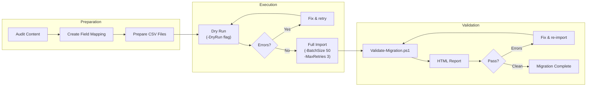

# Migration Guide

Step-by-step guide for migrating content into the SharePoint Knowledge Hub.

## Migration Pipeline Overview



> See the full migration pipeline diagram: [`docs/diagrams/migration-flow.md`](diagrams/migration-flow.md)

## Pre-Migration Checklist

- [ ] Knowledge Hub sites deployed and verified (run `Deploy-KnowledgeHub.ps1`)
- [ ] Taxonomy deployed (run `Deploy-Taxonomy.ps1`)
- [ ] Content types and lists deployed (run `Deploy-ContentTypes.ps1`)
- [ ] Search schema configured (run `Configure-Search.ps1`)
- [ ] PnP.PowerShell module installed (`Install-Module PnP.PowerShell`)
- [ ] Appropriate permissions granted (Site Collection Admin or list Edit rights)
- [ ] Source content audited and cleaned (see Content Audit below)
- [ ] Column mapping file prepared (see Mapping Instructions below)
- [ ] Test import completed with a small sample (5-10 items)
- [ ] Stakeholder sign-off on content structure and taxonomy

## Content Audit Steps

### 1. Inventory Existing Content

Gather all source content from existing systems:

| Source | Format | Estimated Items | Owner |
|---|---|---|---|
| Legacy SharePoint | Lists/Libraries | TBD | IT Team |
| File Shares | Documents | TBD | Department leads |
| Confluence/Wiki | Pages | TBD | Engineering |
| Email archives | .msg/.eml | TBD | KM Team |
| Manual/Paper | Scanned PDFs | TBD | Operations |

### 2. Content Quality Review

For each source, evaluate:

- **Relevance:** Is this content still needed? (Remove obsolete items)
- **Accuracy:** Is the information current? (Flag items needing review)
- **Completeness:** Does it have all required metadata? (Fill gaps)
- **Duplication:** Are there duplicate or near-duplicate items? (Consolidate)
- **Classification:** What category, department, and audience does it belong to?

### 3. Content Transformation

Prepare content for the Knowledge Hub format:

- Convert documents to HTML for Knowledge Article body content
- Extract FAQ question/answer pairs from source materials
- Standardize metadata values to match the taxonomy
- Resize and optimize images for web
- Remove any confidential or PII data not appropriate for the Knowledge Hub

### 4. Prepare CSV Files

Use the provided templates in `migration/templates/`:

- `article-import-template.csv` - Knowledge articles
- `faq-import-template.csv` - FAQ items

Ensure:
- UTF-8 encoding (critical for special characters)
- Category and Department values match taxonomy terms exactly
- Date fields use `YYYY-MM-DD` format
- HTML content in Body/Answer fields is well-formed
- Tags are semicolon-separated

## Mapping Instructions

### Field Mapping File

Create a JSON mapping file based on `migration/templates/field-mapping-example.json`:

```json
{
  "mappings": [
    {
      "sourceColumn": "CSV Column Header",
      "targetField": "SharePoint Internal Field Name",
      "type": "Text|Note|DateTime|Number|TaxonomyFieldType|Choice|User",
      "required": true,
      "termSetName": "Categories"
    }
  ]
}
```

### Field Type Reference

| Type | Source Format | Example |
|---|---|---|
| `Text` | Plain text, max 255 chars | `"How to Reset Password"` |
| `Note` | HTML or plain text, unlimited | `"<p>Step 1: Go to...</p>"` |
| `DateTime` | `YYYY-MM-DD` or `MM/DD/YYYY` | `"2026-06-30"` |
| `Number` | Integer or decimal | `"42"` or `"3.14"` |
| `TaxonomyFieldType` | Term label (exact match) | `"IT & Technology"` |
| `Choice` | One of the allowed values | `"Published"` |
| `User` | Email or login name | `"john@contoso.com"` |

### Common Mapping Scenarios

**Knowledge Articles:**
| Source Column | Target Field | Notes |
|---|---|---|
| Title / Name / Subject | `Title` | Required, max 255 chars |
| Content / Body / Description | `KHBody` | HTML allowed |
| Category / Topic | `KHCategory` | Must match taxonomy term |
| Department / Team / Owner | `KHDepartment` | Must match taxonomy term |
| Keywords / Tags | `KHTags` | Semicolon-separated |
| Status | `KHStatus` | Draft, In Review, Published, Archived |

## Execution Steps

### Step 1: Dry Run

```powershell
.\Import-ContentFromCsv.ps1 `
    -SiteUrl "https://contoso.sharepoint.com/sites/KnowledgeHub" `
    -ListName "Knowledge Articles" `
    -CsvPath ".\articles.csv" `
    -MappingFile ".\mapping.json" `
    -DryRun
```

Review the output. Address any warnings before proceeding.

### Step 2: Small Batch Test

Import a small subset (first 10 rows):

```powershell
# Create a test CSV with first 10 rows
Import-Csv .\articles.csv | Select-Object -First 10 | Export-Csv .\articles-test.csv -NoTypeInformation

.\Import-ContentFromCsv.ps1 `
    -SiteUrl "https://contoso.sharepoint.com/sites/KnowledgeHub" `
    -ListName "Knowledge Articles" `
    -CsvPath ".\articles-test.csv" `
    -MappingFile ".\mapping.json" `
    -BatchSize 5
```

Manually verify the imported items in SharePoint.

### Step 3: Full Import

```powershell
.\Import-ContentFromCsv.ps1 `
    -SiteUrl "https://contoso.sharepoint.com/sites/KnowledgeHub" `
    -ListName "Knowledge Articles" `
    -CsvPath ".\articles.csv" `
    -MappingFile ".\mapping.json" `
    -BatchSize 50 `
    -MaxRetries 3
```

Monitor the progress bar and log file. The script will:
- Process items in batches of 50 with throttling pauses
- Retry failed items up to 3 times with exponential backoff
- Generate detailed logs and error reports

### Step 4: Import FAQ Items

```powershell
.\Import-ContentFromCsv.ps1 `
    -SiteUrl "https://contoso.sharepoint.com/sites/KnowledgeHub" `
    -ListName "FAQs" `
    -CsvPath ".\faqs.csv" `
    -MappingFile ".\faq-mapping.json"
```

### Step 5: Upload Documents

For Policy Documents and Training Materials (document libraries), use PnP directly:

```powershell
Connect-PnPOnline -Url "https://contoso.sharepoint.com/sites/KH-Policies" -Interactive

$files = Get-ChildItem -Path ".\policies\*" -Include *.docx,*.pdf
foreach ($file in $files) {
    Add-PnPFile -Path $file.FullName -Folder "Policies" -Values @{
        KHCategory     = "Legal & Compliance"
        KHDepartment   = "Legal"
        KHStatus       = "Published"
        KHEffectiveDate = "2026-01-01"
        KHReviewDate   = "2027-01-01"
    }
}
```

## Validation Procedures

### Automated Validation

Run the validation script after import:

```powershell
.\Validate-Migration.ps1 `
    -SourceCsv ".\articles.csv" `
    -SiteUrl "https://contoso.sharepoint.com/sites/KnowledgeHub" `
    -ListName "Knowledge Articles"
```

This generates an HTML report showing:
- Missing items (in CSV but not in SharePoint)
- Field mismatches (different values between CSV and SharePoint)
- Extra items (in SharePoint but not in CSV)
- Overall pass rate

### Manual Validation Checklist

- [ ] Spot-check 10% of imported items in the browser
- [ ] Verify taxonomy metadata appears correctly in views
- [ ] Test search: search for known articles and verify results
- [ ] Verify web parts display imported content correctly
- [ ] Check article links and cross-references
- [ ] Validate HTML rendering in article body content
- [ ] Confirm permissions: test with a non-admin account
- [ ] Test feedback submission on imported articles

## Rollback Plan

If migration needs to be reversed:

### Quick Rollback (within 93 days)

1. Delete all imported items from the target list
2. Items will be in the site Recycle Bin for 93 days
3. To permanently remove: empty the Recycle Bin

```powershell
# Delete all items in a list (use with caution)
$items = Get-PnPListItem -List "Knowledge Articles" -PageSize 500
foreach ($item in $items) {
    Remove-PnPListItem -List "Knowledge Articles" -Identity $item.Id -Force
}
```

### Full Rollback

1. Export current state first (for safety):
   ```powershell
   .\Export-SharePointContent.ps1 -SiteUrl "..." -ListName "Knowledge Articles" -OutputPath ".\backup" -IncludeVersionHistory
   ```
2. Delete all items from target lists
3. Re-run migration from original source if corrections were made
4. Re-validate with `Validate-Migration.ps1`

### Partial Rollback

For fixing specific items, use the error log from the import:

```powershell
# Re-import only failed items
Import-Csv .\import-errors_*.csv | ForEach-Object {
    $row = $_.Row
    # Fix the issue in the source CSV, then re-import specific rows
}
```
