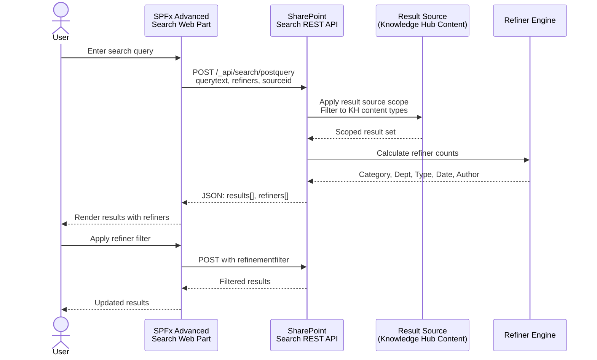

# Search Configuration Guide

## Overview

The Knowledge Hub search is powered by SharePoint Search with custom managed properties, a dedicated result source, search verticals, and configurable refiners. The SPFx Advanced Search web part provides the user-facing search experience.

### Search Architecture Flow

> See the full search architecture sequence diagram: [`docs/diagrams/search-flow.md`](diagrams/search-flow.md)

## Managed Properties Reference

The following custom managed properties are created and mapped for the Knowledge Hub.

| Managed Property | Type | Crawled Property | Searchable | Queryable | Retrievable | Refinable | Sortable |
|---|---|---|---|---|---|---|---|
| `KHCategory` | Text | `ows_taxId_KHCategory` | Yes | Yes | Yes | Yes | No |
| `KHDepartment` | Text | `ows_taxId_KHDepartment` | Yes | Yes | Yes | Yes | No |
| `KHTags` | Text | `ows_KHTags` | Yes | Yes | Yes | No | No |
| `KHStatus` | Text | `ows_KHStatus` | No | Yes | Yes | Yes | Yes |
| `KHReviewDate` | DateTime | `ows_KHReviewDate` | No | Yes | Yes | Yes | Yes |
| `KHViewCount` | Integer | `ows_KHViewCount` | No | Yes | Yes | No | Yes |
| `KHDifficulty` | Text | `ows_KHDifficulty` | No | Yes | Yes | Yes | No |
| `KHAudience` | Text | `ows_taxId_KHAudience` | Yes | Yes | Yes | Yes | No |
| `KHEffectiveDate` | DateTime | `ows_KHEffectiveDate` | No | Yes | Yes | Yes | Yes |

### Built-in Properties Also Used

| Property | Purpose |
|---|---|
| `Title` | Article/document title |
| `Path` | Item URL |
| `Author` | Content author |
| `LastModifiedTime` | Last modified timestamp |
| `ContentType` | SharePoint content type name |
| `ViewsLifeTime` | Page/item view count (built-in analytics) |
| `Description` | Item description |
| `HitHighlightedSummary` | Search result snippet with highlighting |
| `PictureThumbnailURL` | Thumbnail image URL |

## Result Source Configuration

### Knowledge Hub Content Result Source

| Setting | Value |
|---|---|
| **Name** | Knowledge Hub Content |
| **Protocol** | Local SharePoint |
| **Query Transform** | `{searchTerms} (contenttype:"Knowledge Article" OR contenttype:"FAQ Item" OR contenttype:"Policy Document" OR contenttype:"Training Material")` |
| **Scope** | Site Collection |

### How to Configure (Manual)

1. Go to **Site Settings** > **Search** > **Result Sources**
2. Click **New Result Source**
3. Enter the name and description
4. Set Protocol to **Local SharePoint**
5. In the Query Transform box, paste the query template above
6. Click **Save**

### Using the Result Source in Search

In the Advanced Search web part, set the `resultSourceId` property to the GUID of this result source. The web part will scope all queries to Knowledge Hub content.

## Refiner Setup

### Configured Refiners

| Display Name | Managed Property | Type | Max Values | Sort Order |
|---|---|---|---|---|
| Category | `KHCategory` | Multi-value checkboxes | 15 | 1 |
| Department | `KHDepartment` | Multi-value checkboxes | 15 | 2 |
| Content Type | `ContentType` | Multi-value checkboxes | 10 | 3 |
| Date Range | `LastModifiedTime` | Date intervals | 5 | 4 |
| Author | `Author` | Multi-value checkboxes | 10 | 5 |
| Status | `KHStatus` | Multi-value checkboxes | 5 | 6 |

### Date Range Intervals

The `LastModifiedTime` refiner uses predefined intervals:

- Past 24 hours
- Past week
- Past month
- Past 6 months
- Past year

### Configuring Refiners in SharePoint

1. Navigate to the search results page
2. Edit the page and add/edit the Refinement web part
3. Configure refiners in the web part properties
4. Map each refiner to the managed property
5. Set display type, maximum values, and sort order

The SPFx Advanced Search web part handles refiners programmatically via the Search REST API's `refiners` and `refinementfilters` parameters.

## Search Vertical Configuration

### Verticals

| Vertical | Query Filter | Icon | Description |
|---|---|---|---|
| **All** | (no additional filter) | Search | All Knowledge Hub content |
| **Articles** | `contenttype:"Knowledge Article"` | ReadingMode | Knowledge base articles |
| **FAQs** | `contenttype:"FAQ Item"` | QandA | Frequently asked questions |
| **Policies** | `contenttype:"Policy Document"` | Shield | Policy and compliance docs |
| **Training** | `contenttype:"Training Material"` | Education | Training and learning |

### How to Configure Search Verticals

Search verticals are configured at the organization or site level through the Microsoft 365 admin center:

1. Go to [Microsoft 365 admin center](https://admin.microsoft.com)
2. Navigate to **Settings** > **Search & intelligence** > **Customizations**
3. Select **Verticals** > **Add a vertical**
4. For each vertical above:
   - Enter the name and icon
   - Set the query filter (KQL)
   - Choose the content source
   - Configure the result layout (if custom)
5. Publish the vertical

Alternatively, at the **site level**:
1. Go to **Site Settings** > **Search** > **Search Verticals**
2. Add each vertical with the appropriate query template

## Query Rules

### Promoted Results (Best Bets)

Configure query rules to promote important content for common searches:

| Query Contains | Promoted Result | Priority |
|---|---|---|
| "password reset" | How to Reset Your Password (Article) | High |
| "onboarding" | Employee Onboarding Checklist (Article) | High |
| "expense" | Expense Report Submission Guide (Article) | Medium |
| "vpn" | How to Connect to VPN (FAQ) | Medium |
| "org chart" | Company Organization Chart (FAQ) | Medium |

### Configuration Steps

1. Go to **Site Settings** > **Search** > **Query Rules**
2. Select the result source: **Knowledge Hub Content**
3. Click **New Query Rule**
4. Set the query condition (e.g., "Query Contains: password reset")
5. Add a promoted result with the target URL
6. Set the rule's start and end dates (optional)
7. Save and test

## Search Analytics

### Key Metrics to Monitor

| Metric | Source | Frequency |
|---|---|---|
| Top search queries | Search Analytics (admin center) | Weekly |
| Queries with no results | Search Analytics | Weekly |
| Click-through rate | Search Analytics | Monthly |
| Abandoned searches | Search Analytics | Monthly |
| Most viewed articles | `KHViewCount` field | Weekly |
| Search refiners usage | Custom logging (if implemented) | Monthly |

### Optimization Workflow

1. **Review** top queries and no-result queries weekly
2. **Identify** content gaps from no-result queries
3. **Create** missing content or update synonyms/query rules
4. **Monitor** click-through improvements after changes
5. **Adjust** refiners and result sources based on usage patterns

## Troubleshooting

### Common Issues

| Issue | Cause | Solution |
|---|---|---|
| New items not appearing in search | Crawl delay | Wait for the next crawl cycle (15-60 min for SPO) |
| Custom properties not refinable | Property not mapped correctly | Verify crawled property mapping in search schema |
| Taxonomy refiners showing GUIDs | Mapped to wrong crawled property | Map to `ows_taxId_*` (not `ows_taxIdMetadata_*`) |
| Search returning no results | Result source misconfigured | Test the query directly in the Search Query Tool |
| Slow search performance | Overly broad query | Add content type or path scope to narrow results |

### Diagnostic Tools

- **Search Query Tool:** `{siteUrl}/_layouts/15/searchquerytool.aspx` (classic SharePoint)
- **Search Administration:** Site Settings > Search
- **Graph Explorer:** Test Microsoft Graph Search queries at https://developer.microsoft.com/graph/graph-explorer
- **PnP PowerShell:** `Get-PnPSearchConfiguration -Scope Site`
